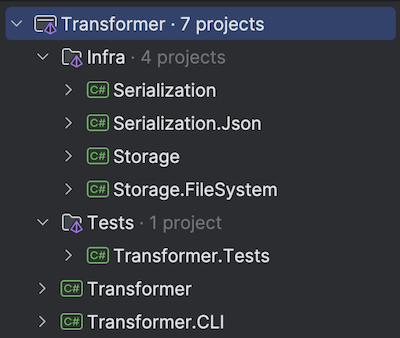
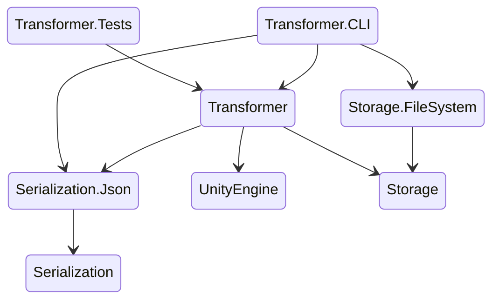

# GameObject-Transformer-CLI


>C# console application that asynchronously reads unordered transform data for an unknown number of objects. 
>Generate GameObjects in memory to match this data, then sort the game objects ordered by distance from origin.
>The console app should output the result as a serialized data structure, required to import the unity dll for this, but not the editor library.
>This will require a 3d math Library as we assume the positions will be Vector3s. Make sure import a math library or the UnityEngine dll


## Projects structure

The project is organized into several key groups, each serving a distinct purpose within the overall architecture:
- `Transformer.CLI`: Contains the CLI application projects.
- `Transformer`: Contains logic how to create and transform game objects, and has dependency for `UnityEngine`
- `Infra`: Contains the infrastructure parts, providing foundational services and utilities: Serialization, Storage.
- `Tests`: Houses unit tests, ensuring reliability and robustness.
    - [NUnit](https://nunit.org//) unit testing framework.



Simplified application structure


##  IGameObjectService


`IGameObjectService`  defines methods for transforming game objects and managing their data representation.

```csharp
/// <summary>
/// Defines methods for transforming game objects and managing their data representation.
/// </summary>
public interface IGameObjectService
{
    /// <summary>
    /// Transforms game object data from the specified input to the specified output.
    /// </summary>
    /// <param name="input">The source path of the game object data to transform.</param>
    /// <param name="output">The destination path for the transformed game object data.</param>
    /// <param name="token">A token to monitor for cancellation requests.</param>
    /// <exception cref="GameObjectServiceException">Thrown when the transformation fails due to a service error.</exception>
    /// <exception cref="OperationCanceledException">Thrown when the operation is canceled via the cancellation token.</exception>
    /// <returns>A task representing the asynchronous operation.</returns>
    Task Transform(string input, string output, CancellationToken token = default);

    /// <summary>
    /// Transforms a collection of game objects into a new representation.
    /// </summary>
    /// <param name="gameObjectDtos">A read-only collection of game object data transfer objects to transform.</param>
    /// <param name="token">A token to monitor for cancellation requests.</param>
    /// <exception cref="GameObjectServiceException">Thrown when the transformation fails due to a service error.</exception>
    /// <exception cref="OperationCanceledException">Thrown when the operation is canceled via the cancellation token.</exception>
    /// <returns>A task that represents the asynchronous operation, containing the transformed game object collection.</returns>
    Task<IReadOnlyCollection<GameObjectDto>> Transform(IReadOnlyCollection<GameObjectDto> gameObjectDtos, CancellationToken token = default);
}
```